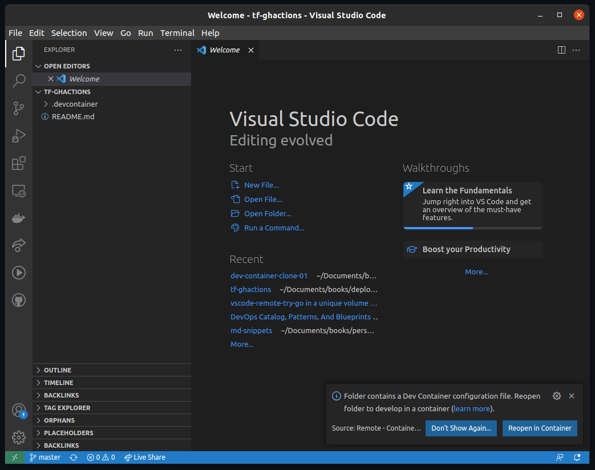

# Dev Container 

## Target Audience

People interested in DevOps culture and would like to create Infrastructure as Code (IaC).

## Abstract
### VS Code as a dev-container for smart-provisioning

The idea is to create an common environment to a team. In short, a development container is created with all the tools necessary to share Terraform templates across a DevOps team.

## Hands-on session

## Service and related products

1. Golang 
2. Terraform
3. VS Code 

## Golang


## Terraform 

The dev-container has the Terraform binary installed.

## VS Code 

The process installs some **VS Code Extensions** to save time for the team.

Extensions:
- golang.Go
- 4ops.terraform
- omartawfik.github-actions-vscode
- redhat.vscode-yaml

## How to use

1. Clone the repository using VS Code.

```
# On Linux
CTRL+SHIFT+P or F1

# Type there
Git: Clone

# Type the repository name
https://github.com/thiagofborn/tf-ghactions
 
```

2. If the message to **Reopen in Container** does not show up as the picture depicts



* Open a new VS Code Window
* Go to **File** 
* Open the folder
* Select the root folder you have cloned *tf-ghactions*

That will force the **Reopen in Container** to show up.

Rebuild.